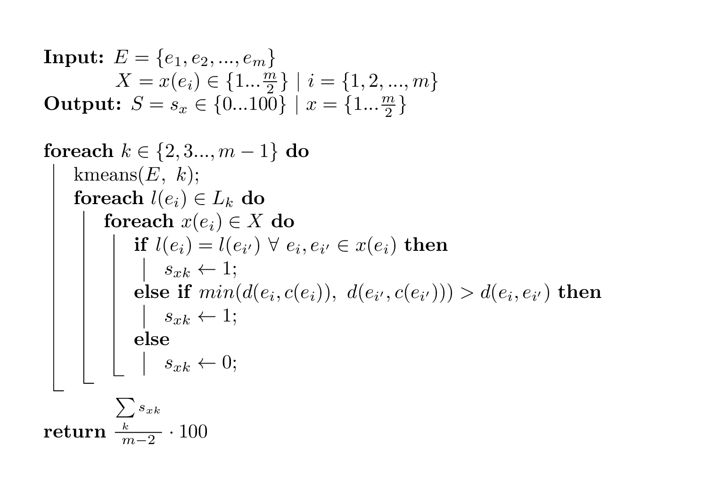

```{r setup, include = FALSE}
knitr::opts_chunk$set(
    collapse = TRUE,
    comment = "#>",
    crop = NULL ## Related to https://stat.ethz.ch/pipermail/bioc-devel/2020-April/016656.html
)
```


```{r vignetteSetup, echo=FALSE, warning = FALSE}
## Track time spent on making the vignette
startTime <- Sys.time()
## Bib setup
suppressPackageStartupMessages(library("RefManageR"))
## Write bibliography information
bib <- c(
    R = citation(),
    BiocStyle = citation("BiocStyle")[1],
    knitr = citation("knitr")[1],
    RefManageR = citation("RefManageR")[1],
    rmarkdown = citation("rmarkdown")[1],
    sessioninfo = citation("sessioninfo")[1],
    testthat = citation("testthat")[1],
    microSTASIS = citation("microSTASIS")[1]
)
```

# Introduction

The initial idea behind **µSTASIS** was to warrant the proper processing of high-dimensional, sparse, undetermined, right skewed, overdispersed and compositional data. Specifically, it aims to fill the gap of temporal stability metrics in the compositional analysis of microbiome data. However, it can also work if the data are not transformed for belonging to the [Aitchison simplex](https://en.wikipedia.org/wiki/Compositional_data).

On one side, the assumptions in which µSTASIS is based are two: the individual-specific composition and the within-individual variability over time. On the other side, the output, which we called mS score, is easy to interpret and provides a contextualized and intuitive metric to estimate temporal microbiota stability. Also, the package incorporates cross-validation routines (leave-one-out and k-fold), that compute the mean absolute error,  and multiple functions to visualize the result.

Therefore, sort of the questions that could be answered are related with robust time-resolved definitions of stability to assess microbiota behaviour against perturbations or to search for specific compositions that present a dynamic equilibrium around a central attractor state rather than overcoming a threshold of no return.

## Algorithm

Firstly, two samples from the same individual has to be paired. For that, one can merge the sequential paired times (t1 with t2, t2 with t3...) or use a non-sequential order (t1 with t3). Therefore, from a single large data matrix, we would generate more that are smaller, that is, with fewer observations (samples).

Once we have the paired samples, it is time for the main algorithm: iterative clustering. Concretely, Hartigan-Wong k-means algorithm is used as many times as possible for stressing out paired samples from the same individuals to test if they remain together for multiple numbers of clusters over a whole data set of individuals. Also, this is corrected in those cases where the distance between samples from the same individuals is lower than the distances to their respective centroids.



## Why Bioconductor?

Although the package was initially released at CRAN, we feel that releasing it at Bioconductor could add better experience to the user. Some functions were internally modifyed leveraging on other Bioconductor packages as well as we added interoperability of our workflow with `TreeSummarizedExperiment`.

* `r Biocpkg("microSTASIS")` `r Citep(bib[["microSTASIS"]])`

# Basics

## Install `microSTASIS`

`r Biocpkg("microSTASIS")` is a `R` package available via the [Bioconductor](http://bioconductor.org) repository (formerly at [CRAN](https://cran.r-project.org/package=microSTASIS)) which can be installed by using the following commands in your `R` session:

```{r "install", eval = FALSE}
if (!requireNamespace("BiocManager", quietly = TRUE)) {
      install.packages("BiocManager")
  }
BiocManager::install("microSTASIS")
## Check that you have a valid Bioconductor installation
BiocManager::valid()
```

## Citing `microSTASIS`

We hope that `r Biocpkg("microSTASIS")` will be useful for your research. Please use the following information to cite the package and the overall approach. Thank you!

```{r "citation"}
## Citation info
citation("microSTASIS")
```

# Quick start to using `microSTASIS`

```{r "start"}
## Load the package
library("microSTASIS")
```

The input data can be a matrix where the rownames include ID, common pattern and sampling time and columns are the microbial features i.e. amplicon sequence variants (ASVs) or operational taxonomic units (OTUs). Alternatively, it can be a TreeSummarizedExperiment object containing the matrix in an `assay` slot or within an `altExps` (alternative experiment) slot. Then, the ID and sampling time info should be in the `colData` slot.

```{r "input"}
## Show the input data
clr[1:8, 1:6]
```

The first step is to subset an initial matrix of microbiome data with multiple sampling points. The`pairedTimes()` function already do it for every possible paired times in a `sequential = TRUE` way or for specific times points, for example: `sequential = FALSE, specifiedTimePoints = c("1", "3")`. The output is a list with length equal to the number of paired times.

```{r "pairedTimes"}
## Subseting the initial data to a list of multiple paired times
times <- pairedTimes(data = clr, sequential = TRUE, common = "_0_")
```

Alternatively, the input can also be a `TreeSummarizedExperiment`, like below.

```{r "TSE"}
## Loading the TSE package
suppressPackageStartupMessages(library(TreeSummarizedExperiment))
```

```{r "makeObject"}
## Creating a TreeSummarizedExperiment object
ID_common_time <- rownames(clr)
samples <- 1:dim(clr)[1]
metadata <- data.frame(samples, stringr::str_split(ID_common_time, "_", 
                                                   simplify = TRUE))
colnames(metadata)[2:4] <- c("ID", "common", "time_point")
both_tse <- TreeSummarizedExperiment(assays = list(counts = t(clr)), 
                                     colData = metadata)
altExp(both_tse) <- SummarizedExperiment(assays = SimpleList(data = t(clr)), 
                                         colData = metadata)
assayNames(altExp(both_tse)) <- "data"
```

```{r "pairedTimesTSE"}
## Subseting the data as two different TSE objects to two list of multiple paired times
TSE_times <- pairedTimes(data = both_tse, sequential = TRUE, assay = "counts",
                         alternativeExp = NULL,
                         ID = "ID", timePoints = "time_point")
TSE_altExp_times <- pairedTimes(data = both_tse, sequential = TRUE, 
                                assay = "data", alternativeExp = "unnamed1",
                                 ID = "ID", timePoints = "time_point")
```

It is pretty important not to forget `sequential = FALSE` when the user wants to get `specifiedTimePoints`.

## Main algorithm

Then, it is time for `iterativeClustering()`, which can be done in parallel and runs for every item in the list.

```{r "iterativeClustering"}
## Main algorithm applied to the matrix-derived object
mS <- iterativeClustering(pairedTimes = times, common = "_")
```

Note that the downstream functions work equally once we have the `pairedTimes()`output. Also, `BPPARAM` can be specified as following `BiocParallel` guides.

```{r "iterativeClusteringTSE"}
## Main algorithm applied to the TSE-derived object
mS_TSE <- iterativeClustering(pairedTimes = TSE_times, common = "_")
```


## Visualization

There are two main functions for visualizing the results: a scatter plot with boxplots on the side and a heatmap.

```{r "visualization"}
## Prepare the result for the later visualization functions
results <- mSpreviz(results = mS, times = times)
## Scatter plot of the stability scores per patient and time
mSscatter(results = results, order = "median", times = c("t1_t25", "t25_t26"), 
          gridLines = TRUE, sideScale = 0.2)
## Heatmap of the stability scores per patient and time
mSheatmap(results = results, order = "mean", times = c("t1_t25", "t25_t26"), 
          label = TRUE)
```

Both functions can be sorted by the stability score by the argument `order`.

The interpretation of both visualizations is similar. One the one side we can see how the stability scores differ a little bit between the sampling points, although the boxplots show that the values range from 0 to 1. Equally, the heatmap allows to see what are the most stable patients over sampling points.

## Cross-validation

The stability results can be validated by cross validation (CV) in two ways: leave-one-out or k-fold. `k` is the number of individuals removed in each time that `iterativeClustering()` is run internally; it is equal to 1 for the LOOCV.

```{r "CV"}
## Cross validation in a parallelized way with different k-fold values
cv_klist_k2 <- BiocParallel::bpmapply(iterativeClusteringCV, name = names(times), 
                                      k = rep(2L, 3), 
                                      MoreArgs = list(pairedTimes = times, 
                                                      results = mS, 
                                                      common = "_0_"))
```

Then, the result can be displayed in two ways: as the mean absolute error or as a visual representation of how the mS score change.

```{r "error"}
## Calculate the mean absolute error after computing the cross validation
MAE_t1_t25 <- mSerrorCV(pairedTime = times$t1_t25, CVklist = cv_klist_k2[[1]],  
                        k = 2L)
```

Remember that for both `mSerrorCV()` and `mSlinesCV()`, `k` argument has to be the same previously used for extracting the input for `CVklist`. For that, we recommend to save it in another local variable and then use it for the arguments of the different functions.

```{r "error viz"}
## Prepare the result for the later visualization functions
MAE <- mSpreviz(results = list(MAE_t1_t25), times = list(t1_t25 = times$t1_t25))
## Heatmap of the mean absolute error values per patient and time
mSheatmap(results = MAE, times = c("t1_t25", "t25_t26"), label = TRUE,
          high = 'red2',  low = 'forestgreen', midpoint = 5)
```

The visualizations allows to look at the reliability of the stability metric for our data set and to detect some cases where the score should not be taken doubtlessly.

```{r "lines"}
## Line plot of the stability scores per patient at a given paired times
## Both the proper score after iterative clustering and the cross validation ones
mSlinesCV(pairedTime = times$t1_t25, CVklist = cv_klist_k2[[1]], k = 2L)
```

The lines visualizations should be seen as a way to track how the stability score for an individual in a given paired time changes in dependence to the data set i.e. when removing other individuals. Variability is expected, but heavy drops or increases not.

## Metadata integration

The analysis can also be integrated with metadata of the individuals in the following way.

```{r "metadata"}
## Create a metadata data frame
metadata <- data.frame(Sample = rownames(clr), age = c(rep("youth", 65), 
                                                       rep("old", 131-65)))
## Modify the metadata to the proper format that match with results
group <- mSmetadataGroups(metadata = metadata, samples = metadata$Sample, 
                          common = "_0_", individuals = results$individual, 
                          variable = "age")
## Boxplot with individual stability scores split by groups
mSdynamics(results, groups = group, points = TRUE, linetype = 0)
```

This plot allow to track general trends of stability in different groups across time.

# Reproducibility

The `r Biocpkg("microSTASIS")` package `r Citep(bib[["microSTASIS"]])` was made possible thanks to:

* R `r Citep(bib[["R"]])`
* `r Biocpkg("BiocStyle")` `r Citep(bib[["BiocStyle"]])`
* `r CRANpkg("knitr")` `r Citep(bib[["knitr"]])`
* `r CRANpkg("RefManageR")` `r Citep(bib[["RefManageR"]])`
* `r CRANpkg("rmarkdown")` `r Citep(bib[["rmarkdown"]])`
* `r CRANpkg("sessioninfo")` `r Citep(bib[["sessioninfo"]])`
* `r CRANpkg("testthat")` `r Citep(bib[["testthat"]])`

This package was developed using `r BiocStyle::Biocpkg("biocthis")`.


Code for creating the vignette.

```{r createVignette, eval=FALSE}
## Create the vignette
library("rmarkdown")
system.time(render("microSTASIS.Rmd", "BiocStyle::html_document"))
## Extract the R code
library("knitr")
knit("microSTASIS.Rmd", tangle = TRUE)
```

Date the vignette was generated.

```{r reproduce1, echo=FALSE}
## Date the vignette was generated
Sys.time()
```

Wallclock time spent generating the vignette.

```{r reproduce2, echo=FALSE}
## Processing time in seconds
totalTime <- diff(c(startTime, Sys.time()))
round(totalTime, digits = 3)
```

# R session information

```{r reproduce3, echo=FALSE}
## Session info
library("sessioninfo")
options(width = 120)
session_info()
```

# Bibliography

This vignette was generated using `r Biocpkg("BiocStyle")` `r Citep(bib[["BiocStyle"]])`
with `r CRANpkg("knitr")` `r Citep(bib[["knitr"]])` and `r CRANpkg("rmarkdown")` `r Citep(bib[["rmarkdown"]])` running behind the scenes.

Citations made with `r CRANpkg("RefManageR")` `r Citep(bib[["RefManageR"]])`.

```{r vignetteBiblio, results = "asis", echo = FALSE, warning = FALSE, message = FALSE}
## Print bibliography
PrintBibliography(bib, .opts = list(hyperlink = "to.doc", style = "html"))
```